[](https://github.com/nogibjj/Meron_Gedrago_mini_Individual2/actions/workflows/PythonCI.yml)

[](https://github.com/nogibjj/Meron_Gedrago_mini_Individual2/actions/workflows/RustCI.yml)

# Meron Gedrago Individual 2

## Structure of the project  
```
├── .devcontainer/
│   ├── devcontainer.json
│   └── Dockerfile
├── .github/
│   └── workflows/
│        ├──PythonCI.yml
│        └──RustCI.yml
├── src
│   ├── lib.rs
│   └── main.rs 
├── .gitignore
├── visuals
├── Cargo.toml
├── Cargo.lock
├── main.py
├── test_main.py
├── Makefile
├── requirements.tx
└── README.md

```

## Purpose of the project  

This project aims is to create a rust project from an existing python project project and compare the performance between the two languages. I show how to perform CRUD (Create, Read, Update and Delete) and compares operation on a dataset from [fivethirtyeight](https://github.com/fivethirtyeight/data/tree/master/births) in Rust and Python. 

[You can also find the video walking through here](https://youtu.be/N-5j9sGJ120)

## Rust code and CLI 

I translated the code from a previous project, where I created a basic ETL pipeline by connecting to SQLite and performing simple SQL queries on a fivethirtyeight data on births from 2000-2014 incuding the number of births reported everyday across the years ([E] Extract a dataset from URL, [T] Transform, [L] Load into SQLite Database and [Q] Query For the ETL-Query lab) You can find the original python project [here](https://github.com/nogibjj/Meron_Gedrago_mini_Week5)

### Compiling and preparation for use 

Since we are working with rust, we need to first check if there any issues with our written code and compile/build our script before we can use our CLI. We can run the following commands below to get started and the outputs of are pictured below:

- cargo check
- cargo build 
- cargo build --release


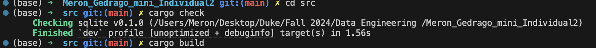

### Manual for CLI 

Now that we have compiled our code, we can now start using our CLI functionalities by typing 'sqlite -h' to ask for the directory/manual of the CLI. We will then see the direction pictured below for the different functionalities in this project: 

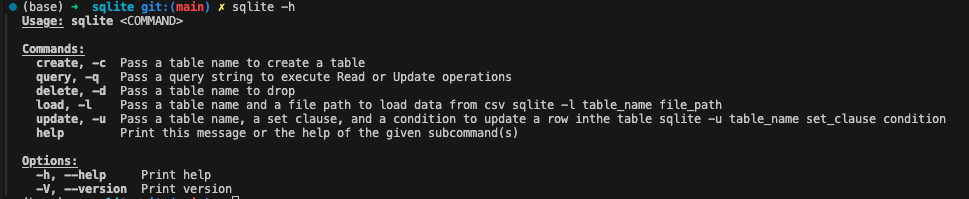

### Demo of the CLI 
#### create an empty table / 'sqlite -c' - *create an empty table called birthtable*
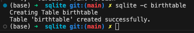

#### load data into the created table / 'sqlite -l' - *load into birthtable from my data directory of csv file*


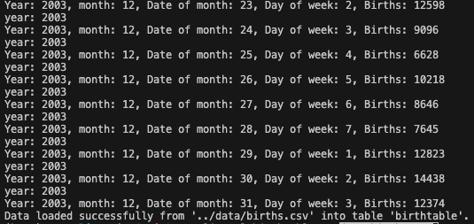

We can also check and see that it has been successfully changed using DB browser on my local computer 

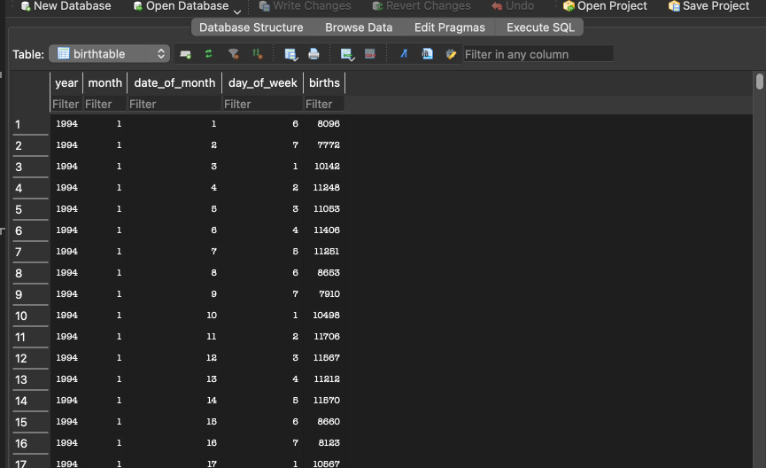


#### updated data / 'sqlite -u' - *update rows of the birthtable by changing births to 0 if the year is 2000*

Instruction that I gave is below:

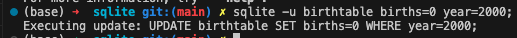

Visualization of how the change was reflected using DB browser on my local computer

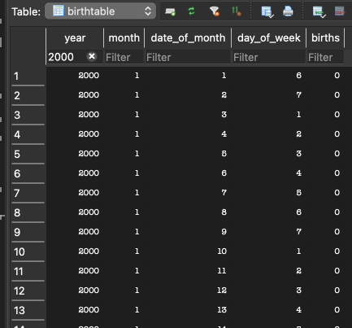

#### Delete table / 'sqlite -d' - *delete the birthtable I created*

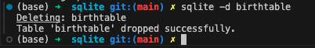

Refreshing on my local computer and checking if it is really deleted

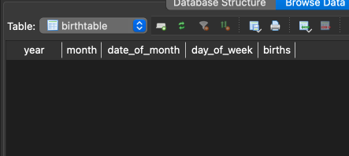

## Format, lint and test before pushing to github 

We can format, lint and test using the following commands before pushing to github. These will still be executed or tested during CI/CD but it could help us catch any errors before commiting and pushing 
- cargo fmt - for formatting 
- cargo clippy - for linting 
- cargo test - for running test that is included in the lib.rs 

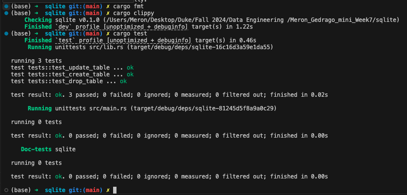

## Comparison of Python and Rust  

I isolated only one function for the purpose of comparison, creating a table. I compared the two languages without any CLI to ensure comparibility and found that Rust was 10 times faster than python as we can see in the screenshot below. 

### Rust speed of creating a test table  
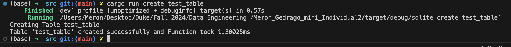

### Python speed of creating a test table  
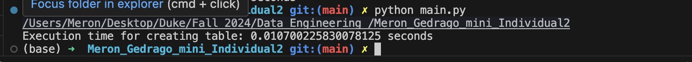


[Link to Rust binary](https://github.com/nogibjj/Meron_Gedrago_mini_Week7/actions/runs/11494954964/artifacts/2097648149)